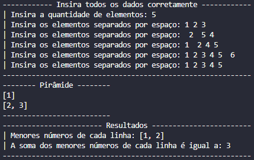

# Meia pirâmide em Java
Código que lê uma sequência de números separados por um espaço em branco e cria uma meia pirâmide com os valores fornecidos. A primeira linha começa com apenas um elemento e vai incrementando um linha a cada linha da pirâmide.

Além de prevenir erros do usuário, caso o usuário digite espaços indevidos, mais elementos do que o informado.

## Funcionamento do código (imagem)
### Imagem do funcionamento normal

### Imagem do funcionamento com tratamentos de erros

## Autor: Pedro Peixoto Viana de Oliveira